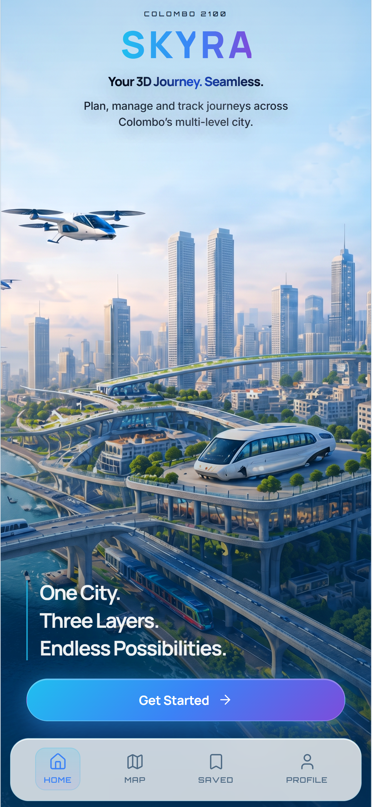

# SkyLayer 🌆✈️

**A 3D Sky-Level Transport Network for Colombo 2100**

Submitted for **Cre8x 3.0 – Round 01: The Oracle Challenge** (Topic: *Transportation 2100*)
Organized by the **KDU BCS Student Chapter**, General Sir John Kotelawala Defence University.

🔗 **Live app:** [your-sky-layer-app.vercel.app]( https://skylayer-cre8x-8uvx.vercel.app/) <!-- replace with your actual deployed link -->

---

## Overview

By 2100, Colombo will grow upwards — rooftops, sky bridges, and urban air corridors will become key mobility layers. Existing journey planners are 2D and ground-focused, and can't represent travel through air, rooftop, ground, and indoor spaces as one seamless experience. This makes complex 3D journeys hard to understand, especially for elderly, disabled, and less tech-confident users.

**SkyLayer** is a unified platform that plans, manages, and tracks journeys across:

- 🚁 **Air** – eVTOL air taxis (SkyLanes)
- 🌉 **Rooftop** – shuttles and sky bridges
- 🚌 **Ground** – buses, trains, and smart roads
- 🧭 **Indoor** – AR navigation inside large buildings

It turns a complex multi-layer network into something simple, safe, and accessible for everyone.

## Key Features

- **Three-layer journey planning** — Sky-first, Mixed, or Ground-first routes
- **Vertical stations** — elevators and lifts shown as predictable, real-time stops with wait times and accessibility info
- **Air corridors & rooftop terminals** — eVTOL air taxis integrated with ground and rooftop transport
- **Weather-aware 3D routing** — rain, wind, and heat affect which sky corridors and rooftop routes are open
- **Social rooftops** — parks, markets, and food courts highlighted along routes
- **Accessibility filters** — step-free, most shaded, fewest transfers, no air travel
- **Indoor AR navigation** — a blue AR path projected on the real floor inside airports, hospitals, universities, and malls

## Who It's For

- Daily commuters avoiding heat, rain, and congestion
- Elderly and disabled users needing step-free, shaded routes
- Parents with children and strollers
- Office workers moving between towers and business districts
- Emergency medical transfers (hospital rooftops → wards)
- University students and staff moving across campuses
- Tourists experiencing a futuristic "city in the sky"

## Accessibility

- Step-free routing by default, with a "Step-free only" filter
- "Most shaded" and "Fewest transfers" filters
- Large text, high contrast, and clear icons (air, shuttle, elevator, bus, train)
- 2D/3D map toggle for users who find 3D maps confusing
- "No air travel" option for anxious or motion-sensitive users
- Sinhala, Tamil, and English support (planned for full version)
- Voice guidance and simple microcopy for less tech-confident users

## User Flow

```
Home → Route Details → Live Map
```

1. **Home – "Plan Your 3D Journey"** — search and filter journeys across sky and ground layers; choose travel style and quick trips.
2. **Route Details – "Your Sky-Level Route"** — step-by-step route with modes (walk, elevator, rooftop shuttle, air taxi, bus), times, and real-time status.
3. **Live Map – "Track Your Journey"** — real-time 3D tracking with 2D/3D toggle, live status card, map legend, voice guidance, and AR indoor preview.

### Example journey: Colombo Fort → NHSL

> Walk → Elevator → Rooftop Shuttle → Air Taxi → Bus → Walk

The user searches "Fort → NHSL", selects **Sky-first**, and follows the live route with an AR indoor preview for navigating inside the hospital.

## Tech Stack

<!-- Fill in what you actually used, e.g.: -->
- Frontend: `React` / `Next.js`
- Styling: `Tailwind CSS`
- Maps / 3D: `Mapbox GL` / `Three.js`
- Hosting: `Vercel`

## Getting Started

```bash
# Clone the repo
git clone https://github.com/your-username/skylayer.git
cd skylayer

# Install dependencies
npm install

# Run locally
npm run dev
```

Open [http://localhost:3000](http://localhost:3000) in your browser (best viewed on mobile / a mobile viewport, as judging is primarily on mobile).

## Screenshots

| Home | 
|---|
|  | 
## Impact & Future Work

- Reduces heat exposure and congestion for daily commuters by using rooftop and air layers
- Makes vertical and multi-layer travel understandable for all users, including elderly and disabled people
- Supports emergency and time-critical journeys via air corridors and rooftop terminals
- Sets a template for how Sri Lankan cities can grow upwards in a human-centered way

**Next steps:** pilot on a small corridor (e.g. Fort–WTC–NHSL) with simulated data, integrate real-time APIs, and expand language support (Sinhala, Tamil, English).

## Team

<!-- Fill in -->
- **[Name 1]** – Role (e.g. UX/UI)
- **[Name 2]** – Role (e.g. Frontend)
- **[Name 3]** – Role (e.g. Research)

**University:** General Sir John Kotelawala Defence University (KDU) — BCS Student Chapter

---

> *"The future is not found. It is designed."* — Cre8x 3.0
